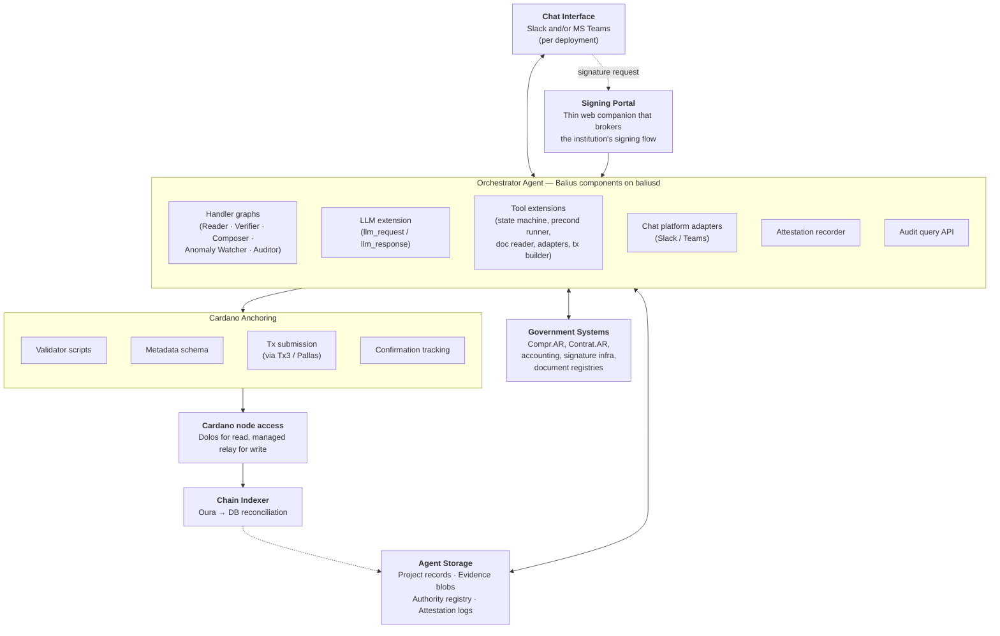
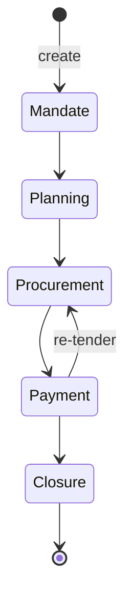

# GOV.EXE

**Public-project execution integrity, anchored on Cardano.**

GOV.EXE is a platform for executing public projects — building a road, modernizing a registry, deploying a digital service — as a verifiable chain of authority decisions. It models the lifecycle of a public project as a five-stage state machine (**Mandate → Planning → Procurement → Payment → Closure**) and anchors every state transition on Cardano. An **AI orchestrator agent** drives the workflow: it reads evidence from existing government systems, runs precondition checks, prepares transitions, and submits them once a human authority signs.

The platform does not replace government systems; it sits *above* them as a verifiable decision chain. Officials interact through Slack or Microsoft Teams — there is no purpose-built operational web app.

> **Status — pre-implementation.** This repository is the future home of the GOV.EXE reference implementation. The architecture has been drafted and is the subject of WP1 institutional review (in collaboration with the Secretariat of Modernization of the Province of Entre Ríos, Argentina). Code lands as work packages WP1 → WP3 progress.

---

## Why this exists

Public-project execution is one of the most operationally complex workflows in any institutional setting: long horizons, many heterogeneous authorities, document-bearing decisions with legal weight, and constant variance (scope changes, re-tenders, suspensions, litigation). The barrier to automation is not consensus — the benefits are well-measured by the World Bank, OECD, and IDB — but the fact that **off-the-shelf workflow systems are too brittle for this domain**. Generic BPM platforms either oversimplify (forcing real-world variance back into email) or freeze workflows into rigid configurations that become operational dead weight.

GOV.EXE combines three properties off-the-shelf systems do not provide together:

1. **Adaptive reasoning** — an AI agent that can absorb document variance and handle the dynamic procedural reality of real projects.
2. **Verifiable integrity** — a blockchain anchor that makes the sequenced authority decisions independently auditable.
3. **Meeting officials where they already work** — chat-based interaction (Slack/Teams), so adoption does not depend on training users on a new system.

---

## Architectural commitments

These are the platform's load-bearing requirements (R1–R8 in the architecture spec). They are the external contract against which every component decision is justified.

- **R1 — On-chain anchoring of every state transition** on Cardano, independently verifiable by any third party.
- **R2 — AI orchestrator agent as the execution core**, not a passive backend service.
- **R3 — Human authority over consequential decisions.** The agent never holds authority keys; every state-changing transition requires an institutional signature.
- **R4 — Chat-based operational surface** via Slack and/or Microsoft Teams. Thin web companions only where chat cannot safely host the interaction (signing, PII rendering).
- **R5 — Read-mostly integration** with existing government systems. The platform records the decision chain on top, not a parallel system of record.
- **R6 — Operability without TxPipe** post-pilot. The institutional partner (or any designated operator) can run the platform independently.
- **R7 — Open-source reference implementation** under Apache 2.0, sufficient for external builders to fork and adapt for new jurisdictions.
- **R8 — Full attestability of agent actions.** Every tool invocation, model call, and document extraction is recorded in a structured attestation bundle whose hash is anchored on-chain.

---

## Architecture at a glance



Six logical components: **Chat Interface**, **Signing Portal**, **Orchestrator Agent** (Balius components on `baliusd`), **Agent Storage**, **Cardano Anchoring layer**, and **Chain Indexer** — plus external **Government Systems**.

---

## The five-stage state machine



| Stage | What happens | Authorizing role | Typical evidence |
|---|---|---|---|
| **Mandate** | Project formally authorized by the competent authority | Executive authority | Signed authorization act, scope, budget envelope |
| **Planning** | Design, scope, and procurement strategy defined | Planning authority | Technical specifications, procurement strategy, cost breakdown |
| **Procurement** | Vendors selected via applicable procedure | Procurement authority | Bidding documents, vendor selection record, contract reference |
| **Payment** | Disbursements against the contract, tied to milestones | Financial authority | Invoice references, payment authorization, delivery acknowledgement |
| **Closure** | Project closed — delivered, accepted, reconciled | Executive authority | Closure act, final reconciliation, completion certification |

Plus exceptional transitions — `Annul`, `Suspend`, `Resume` — available from any stage subject to authority constraints. The five-stage model is fixed; preconditions, evidence requirements, and authorizing roles within each stage are **configurable per jurisdiction**.

Transitions are append-only. Corrections are *new* transitions (e.g., an annulment), never rewrites of past ones.

---

## On-chain anchoring

Per transition, one Cardano transaction carrying:

- **A state token** — a native asset whose presence in a UTxO represents the *current state of a project* (the `asset_name` encodes the project identifier).
- **A datum** — project ID, current stage, evidence-bundle hash, precondition-attestation hash, authorizing key hash, configuration version, previous-transition reference.
- **A metadata payload** — JSON-structured human-readable transition record under a dedicated label, indexable by Oura.
- **A required signatory** — the authorizing key for the to-stage (multi-sig where the stage requires it).

The validator is a state-machine script. Each consuming transaction carries a **redeemer** — an action tag (`Create | Advance | Close | Annul | Suspend | Resume`), the target stage, and optional parameters — that the validator uses as the dispatch key for legality, authority, and continuity checks.

**The validator does not verify the *content* of evidence**, only its binding hash. The chain is the verifier, not the executor — business logic lives in the agent; the script validates that whatever the agent submits, with the required signature, is consistent with the previous state and the locked configuration.

A separate **authority registry** UTxO maps authorizing roles → public key hashes and is referenced as a read-only input. Key rotation is a single registry update, not a per-project migration.

---

## The orchestrator agent

The agent runs as a set of WASM components on **Balius** (TxPipe's event-driven Cardano dApp framework, repositioned as an agent runtime). The `baliusd` daemon is the host; agent roles and tools are handler graphs and extensions registered against `baliusd`'s event dispatcher.

### Why Balius is the substrate

- **Event-driven dispatch is the agent loop.** Chat events, `llm_request` / `llm_response`, `tool_call` / `tool_response`, and chain events all flow through one dispatcher.
- **Per-event checkpointing is structural.** An interrupted session resumes from the last event, not the trigger.
- **`PartialTx` is the natural shape for "agent prepares, human signs".** The daemon never holds authority keys — the custody boundary is structural, not policy-enforced.
- **Deterministic, replayable WASM.** Auditors can re-execute any session from its recorded inputs and verify the same outputs — R8 (attestability) is runtime-provable, not log-trusted.
- **WIT-contracted extensions are the tool model.** New jurisdictions swap extensions; the agent's handler code stays the same.

### Agent roles

Each role is a handler graph inside the GOV.EXE Balius component, parameterized with its own system prompt, allowed tool subset, and policy.

- **Reader** — LLM-assisted extraction of structured fields from PDFs, signed documents, official emails, and system payloads.
- **Verifier** — Runs the precondition checks for a proposed transition; produces a structured precondition report. Does *not* decide whether the transition proceeds.
- **Composer** — Drafts the transition: proposed datum, evidence-bundle manifest, plain-language summary. The summary is what the authorizing official reads in chat before signing.
- **Anomaly Watcher** — Background role flagging out-of-pattern activity (large variance from precedent, missing linked signatures, off-hours activity). Advisory only; never blocks transitions.
- **Auditor (read-only)** — Natural-language Q&A over project histories and aggregated activity. Cites chain references and evidence-bundle hashes. Cannot prepare transitions.

### Tool catalog

The agent's *only* path to anything outside its reasoning context. Every call and response is checkpointed and attested.

- `state_machine.legal_transitions(project_id)`
- `preconditions.list(project_id, target_stage)`
- `adapter.<system>.fetch(...)` — one per government-system adapter
- `reader.extract(evidence_ref, schema)` — LLM-assisted, with citations and confidence
- `evidence.bundle(entries)` — builds a content-addressed manifest
- `tx_builder.compose_transition(state, redeemer, evidence_hash, attestation_hash)` — produces a `PartialTx`
- `tx_builder.submit_signed(signed_tx)` — submits the authority-signed payload returned from the Signing Portal
- `registry.lookup(role)`
- `audit.query(...)`

### Session model

Each transition the agent prepares runs as a discrete session — in Balius terms, a **correlation stream**: every event from trigger to chain confirmation shares one correlation key. The runtime owns the loop. Sessions are bounded by hard limits on tool-call count, time, and token budget; exceeding any limit halts the session and surfaces it to a human. The agent never silently retries forever.

---

## Technology stack

GOV.EXE composes the TxPipe stack with standard cloud infrastructure. No exotic dependencies.

| Layer | Component | Role |
|---|---|---|
| Agent runtime | **Balius** (`baliusd`) | Hosts the GOV.EXE WASM components; dispatcher, checkpointing, `PartialTx` custody boundary |
| Cardano primitives | **Pallas** | CBOR, addresses, tx construction primitives inside `tx_builder` |
| Transaction DSL | **Tx3** | Declarative templates for transition transactions; `tx_builder.compose_transition` invokes Tx3 templates |
| Read-side node | **Dolos** | Local lightweight Cardano node for chain queries and history |
| Chain follower | **Oura** | Indexes the GOV.EXE policy and metadata label into Postgres |
| Hosting target | **Demeter** (optional) | Pilot's Cardano access plane; self-hosting on standard cloud works equally |
| Implementation language | **Rust → WASM** | Handler code uses Balius's macro DSL (`#[chain_event]`, `#[extrinsic_event]`, `#[on_llm_response]`, `#[on_tool_call]`) |
| LLM provider | **Provider-abstract** | Hosted (Anthropic / OpenAI / Google) or self-hosted open-weights — configurable per deployment |
| State storage | Postgres | Project records, attestation logs, indexer state |
| Evidence storage | S3-compatible object storage | Off-chain evidence blobs, content-addressed |
| Chat | Slack and/or MS Teams | Per-deployment choice; both adapters ship with the platform |
| Orchestration | Kubernetes | Standard cloud infrastructure |

---

## Evidence and PII

**No document content goes on-chain.** The transition datum carries only the *hash* of the evidence bundle. The bundle itself is a structured manifest of `(label, content-hash, optional metadata)` entries stored off-chain.

Agent-side data handling:

- No PII in prompts to external model providers without explicit per-deployment authorization. Document classification determines hosted-vs-self-hosted routing.
- Redaction before extraction is the default when the PII itself is not the value being extracted.
- Attestation logs record model ID, prompt hash, schema, and result — never raw document content.
- Government-side data residency requirements override defaults: if the institutional partner requires on-premise inference, the hosted path is disabled.

---

## Pilot context — Entre Ríos, Argentina

The first deployment is the Province of Entre Ríos, with the **Secretariat of Modernization** as the institutional partner. The architecture is built around — but not coupled to — the Argentine federal stack:

- **Compr.AR / Contrat.AR** — federal e-procurement
- **Provincial accounting system** — payment authorizations and disbursements
- **Argentine digital-signature infrastructure** — official PKI for authorization acts
- **Provincial document registries** — signed PDFs referenced as evidence

Each adapter is independently switchable in the jurisdiction config. A future deployment outside Argentina drops the Argentine adapters; the rest still works.

---

## Repository status and structure

This repo is the eventual home of the GOV.EXE reference implementation. Current contents reflect the **pre-WP1** phase: documentation and license only. Code lands progressively across work packages.

Planned top-level layout (subject to change as WP1 / WP2 progress):

```
gov.exe/
├── onchain/             Aiken validator scripts (state machine + authority registry)
├── tx3/                 Tx3 transaction templates (Create, Advance, Close, Annul, Suspend, Resume)
├── agent/               GOV.EXE Balius WASM component (Rust)
│   ├── roles/           Reader · Verifier · Composer · Anomaly Watcher · Auditor handler graphs
│   ├── tools/           Tool extensions (state machine, preconditions, evidence, audit)
│   └── policies/        Per-role system prompts and policy artifacts
├── extensions/          Adapter extensions behind WIT contracts
│   ├── chat-slack/
│   ├── chat-teams/
│   ├── llm/             Model-provider abstraction
│   ├── compr-ar/
│   ├── contrat-ar/
│   ├── accounting/
│   └── signature/
├── signing-portal/      Thin web companion for institution-side signing
├── evidence-viewer/     Thin web companion for PDF / signed-document rendering
├── indexer/             Oura pipeline + Postgres materialized views
├── deploy/              Terraform / Helm / setup runbooks
└── config/              Configuration schema and Entre Ríos pilot config artifacts
```

Concrete subdirectories appear as their work packages begin.

---

## Roadmap

| Phase | Scope | Output |
|---|---|---|
| **Pre-WP1** *(current)* | Internal architecture alignment | This repo, the architecture spec, the Cardano Budget 2026 proposal |
| **WP1** | Institutional architecture with Entre Ríos: transition graph, authorizing-role mapping, precondition catalog, adapter scope, signing infrastructure, chat platform, model provider | Platform Specification (reviewed by Blink Labs and ELK Connect); per-role evaluation criteria |
| **WP2** | Reference implementation: validator scripts, Balius component, adapters, signing portal, evidence viewer, deployment runbook. Independent smart-contract audit before any mainnet deployment | Open-source release under Apache 2.0 at the TxPipe organization |
| **WP3** | Pilot operation in Entre Ríos; hand-off to the Province | Measured unit economics; runbook for independent operation |

Mainnet vs. preprod for pilot operations is decided after audit completion and institutional readiness.

---

## Key principles for contributors

These are the engineering heuristics used to resolve design questions the requirements do not directly dictate. Deviations require explicit discussion and an entry in the decision log.

- **The chain is the verifier, not the executor.** Business logic lives in the agent; the validator validates consistency, not correctness of off-chain evidence.
- **Stage transitions are append-only.** Corrections are new transitions, never rewrites.
- **Adapters are typed and pluggable.** Every external interaction goes through a typed WIT-contracted extension. No free-form inputs at adapter boundaries.
- **Configuration is versioned and locked per project.** A project's history stays interpretable forever; evolving rules do not retroactively change in-flight projects.
- **Single tenancy per jurisdiction at the infrastructure level.** Simpler reasoning, simpler audit, simpler hand-off.
- **Standard cloud infrastructure, no exotic dependencies.** Anything that would tie a deployment to a single vendor or to TxPipe-only infrastructure is avoided.
- **Deterministic, replayable execution.** R8 (attestability) is structural, not bolted-on logging — assurance reviewers re-execute the WASM components against stored inputs to verify outputs.

---

## License

Licensed under the [Apache License, Version 2.0](./LICENSE). Per R7, from WP2 onward the codebase is released under Apache 2.0 at the TxPipe organization, sufficient for an external Cardano builder to fork and adapt the platform for a new jurisdiction.

---

## Further reading

- **Architecture spec** — the full technical architecture (internal, TxPipe engineering; the source for this README's content)
- **Cardano Budget 2026 proposal** — *GOV.EXE: Public Project Execution Integrity, Pilot in Argentina*
- **Companion brief** — *Balius as an AI Agent Harness*
- **TxPipe stack** — [Balius](https://github.com/txpipe/balius), [Pallas](https://github.com/txpipe/pallas), [Tx3](https://github.com/tx3-lang), [Dolos](https://github.com/txpipe/dolos), [Oura](https://github.com/txpipe/oura)
