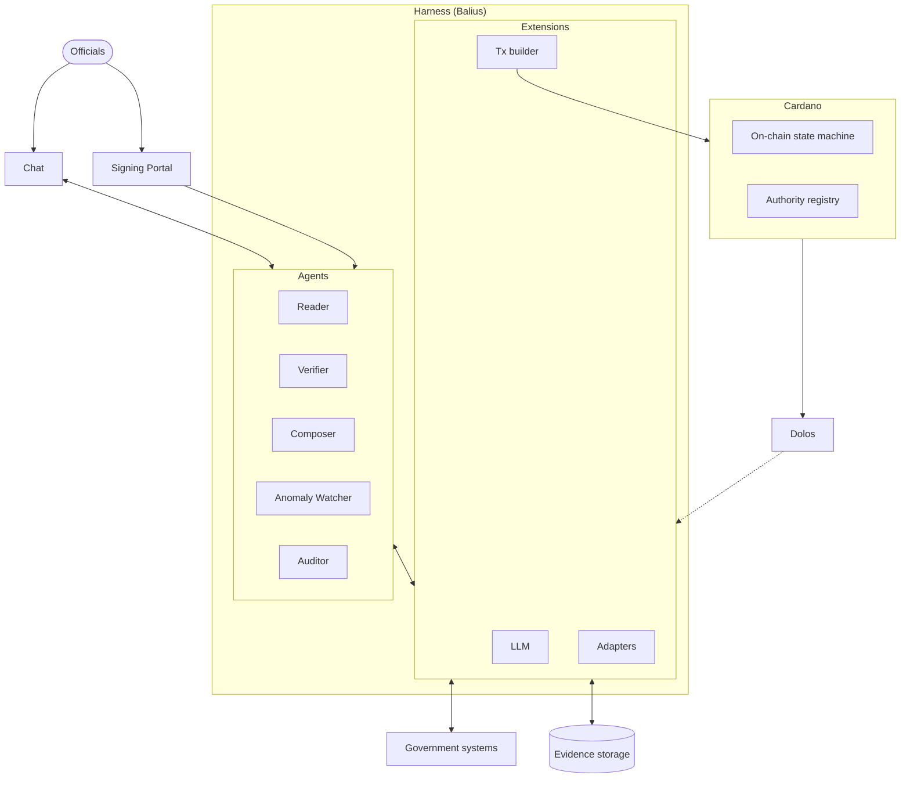
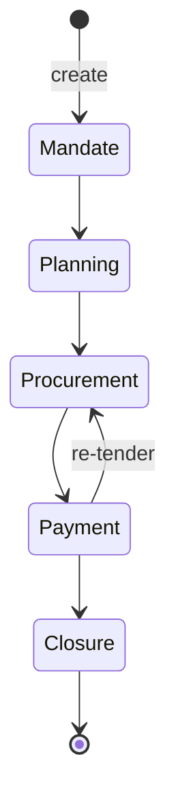

# GOV.EXE — Technical Architecture Spec (Draft)

**Status:** Draft
**Audience:** Cardano builders, institutional partners, and public reviewers
**Scope:** High-level architecture only. This document is the pre-WP1 architecture document — it precedes (and feeds into) the formal "Platform Specification" deliverable in WP1, which will be reviewed by Blink Labs and ELK Connect.
**Positioning:** The platform's execution core is an **AI orchestrator agent**, not a passive backend service. This shapes every component below.
**Companion proposal:** Cardano Budget 2026 — *GOV.EXE: Public Project Execution Integrity, Pilot in Argentina*
**Last updated:** 2026-05-13

---

## Problem statement and motivation

Executing a public project — building a road, modernizing a registry, deploying a digital service — is one of the most operationally complex workflows in any institutional setting. A single project moves through a long sequence of formal stages, each handled by a different authority, each governed by its own legal and procedural framework. Mandate, planning, procurement, contracting, payment, delivery acceptance, closure: each stage produces documents, requires signatures, references prior acts, and feeds the next. The end-to-end horizon is typically measured in years.

The participants are many and heterogeneous: executive authorities, planning teams, procurement bodies, treasuries, control offices, contractors, suppliers, oversight institutions. Information moves between them as documents — decrees, technical specifications, bidding files, contracts, invoices, payment authorizations, closure acts — and the integrity of the project depends on those documents being attested correctly, in the right order, by the right authority, with the right references back to prior acts. The attestations themselves are not casual; they carry legal weight and are the substance of accountability.

This workflow is fundamentally **dynamic**. Real public projects change scope, change contractors, hit re-tenders, get suspended and resumed, encounter litigation, get re-prioritized across political cycles. The procedural environment around them changes too: laws are amended, agency mandates shift, new oversight obligations appear. A workflow model that captures only the happy path is useless; the model has to absorb variance without losing the chain of integrity that makes the record auditable.

The operational consequences of running this workflow on disconnected, document-and-email-based infrastructure are well-documented: delays from manual coordination, lost or contested documents, sequencing errors (e.g., payments authorized against contracts that were never properly attested), opacity that frustrates oversight, and inability to reconstruct a project's history when something goes wrong. The World Bank, the OECD, and the IDB all measure these inefficiencies and fund programs specifically to address them.

Workflow automation can deliver concrete, measurable improvements here: faster cycle times, fewer sequencing errors, complete and reconstructable histories, lower coordination overhead, and substantially better conditions for oversight and audit. The benefits are real. The barrier is not a lack of consensus that automation would help.

The barrier is that **off-the-shelf workflow systems are too brittle for this domain.** Generic BPM platforms and document-management products assume workflows can be enumerated, that integrations are stable, and that participants and procedures don't change underneath them. Real public-project execution violates all three assumptions: workflows mutate, integrations span heterogeneous government systems, and procedures shift with political and legal cycles. Off-the-shelf systems either oversimplify — capturing only the happy path and forcing real-world variance back into email — or they freeze the workflow into rigid configurations that become maintenance burdens and operational dead weight.

What this domain needs is a substrate that combines three properties off-the-shelf systems do not provide together:

1. **Adaptive reasoning** that can absorb document variance, read evidence in the forms it actually arrives in, and handle the dynamic procedural reality of real projects — the role an AI agent can play.
2. **Verifiable integrity** of the sequenced authority decisions, so the platform's record can be trusted as the auditable source of the project's history — the role a blockchain anchor can play.
3. **Meeting officials where they already work**, so adoption does not depend on training thousands of users on a new system — the role a chat-based interface in tools like Slack or Microsoft Teams can play.

GOV.EXE is the architecture that combines these three properties around the workflow that needs them most.

---

## 1. What we're building

GOV.EXE is a public-project execution integrity platform. It models the lifecycle of a public project as a five-stage state machine — **Mandate → Planning → Procurement → Payment → Closure** — and anchors each state transition on Cardano. The platform does not replace the government systems that produce decisions at each stage; it sits *above* them as a verifiable decision chain, with an **AI orchestrator agent** driving precondition checks, document understanding, and transition preparation.

### Architectural requirements

The following are the architecture's load-bearing requirements. Every component decision downstream is justified against this list; any deviation requires explicit discussion and an entry in the decision log.

- **R1 — On-chain anchoring of every state transition.** The platform shall anchor every state transition of every project on Cardano. Each anchored record shall be (a) independently verifiable by any third party without trusting the platform operator, (b) impossible for any single institutional authority to forge or rewrite after the fact, and (c) preserve the institutional sequencing of stages and authorizations.
- **R2 — AI orchestrator agent as the execution core.** The platform shall be operated by an AI orchestrator agent that interprets institutional context, retrieves and reads evidence from government systems (with LLM-assisted extraction for unstructured sources), runs precondition checks, prepares transitions for human authority signature, and drives signed transitions onto the chain. All reasoning and execution paths that affect platform state shall route through the agent.
- **R3 — Human authority over consequential decisions.** No state-changing transition shall be submitted without a signature from the institutional authority designated for the target stage. The agent shall not hold or operate authority keys, and AI judgments shall be recorded as advisory components of the auditable attestation — never as substitutes for an authority signature.
- **R4 — Chat-based operational surface.** The official-facing interaction surface shall be the institution's existing collaboration tool, supported via Slack and/or Microsoft Teams adapters. The platform shall not ship a purpose-built operational web app for day-to-day work. Thin web companions (Signing Portal and Evidence Viewer) are permitted, and only for actions chat cannot safely host (key-backed signing, PII-bearing document rendering).
- **R5 — Read-mostly integration with government systems.** Integrations with existing government systems (procurement, payment, document registries, signature infrastructure) shall be read-mostly. The platform shall not become a system of record for data the government already maintains elsewhere; it shall record the decision chain on top of those systems. Write-back integrations are permitted only where the institutional partner explicitly opts in for a specific adapter.
- **R6 — Operability without TxPipe.** Post-pilot, the institutional partner (or any third-party operator they designate) shall be able to operate the platform without engineering support from TxPipe and without specialized blockchain or AI-operations expertise. The hand-off package shall include deployment runbooks, configuration artifacts, key custody procedures, model-provider configuration, and incident-response procedures sufficient for independent operation.
- **R7 — Open-source reference implementation.** From WP2 onward, the platform codebase shall be released under Apache 2.0 at the TxPipe organization. The release shall be sufficient for an external Cardano builder to fork and adapt the platform for a new jurisdiction, with documented configuration points for the workflow, authority registry, adapters, agent policies, and model provider.
- **R8 — Full attestability of agent actions.** Every action the agent takes while preparing a transition — tool invocations, adapter calls, model invocations (with model ID and prompt hash), and document extractions — shall be recorded into a structured attestation bundle. The bundle's hash shall be anchored on-chain alongside the transition; the underlying trace shall remain replayable from off-chain storage for the lifetime of the deployment, with read access available to assurance reviewers and external auditors.

The pilot deployment is Entre Ríos, Argentina, with the Secretariat of Modernization as the institutional partner. The architecture must therefore accommodate Compr.AR / Contrat.AR-style e-procurement, digital-signature infrastructure, and provincial accounting systems — without being coupled to any one of them.

---

## 2. Architectural principles

The requirements in §1 are the external contract. The principles below are the engineering heuristics that guide how we resolve design questions the requirements do not directly dictate. They are not externally testable and are not stakeholder commitments; they exist to keep design decisions coherent over the course of the build. If a proposed change violates one of these, it requires explicit discussion and an entry in the decision log.

- **The chain is the verifier, not the executor.** Reasoning, integration, and execution logic live in the orchestrator agent; the smart contract validates that whatever the agent submits — with the required institutional signature — is consistent with the previous state and the declared transition rules. We do not push business logic on-chain to "make it more verifiable"; we structure off-chain logic so its result is verifiable on-chain.
- **Stage transitions are append-only.** A project's state history is an immutable sequence. Corrections are *new transitions* (e.g., an annulment stage transition), never rewrites of past ones. This is a design choice that follows from R1, applied uniformly throughout the platform — including off-chain views and operational tooling.
- **Adapters are typed and pluggable.** Every interaction with an external system — government adapter, signing provider, model provider, chat platform — goes through a typed, pluggable adapter with a declared schema. No free-form inputs into adapter boundaries. New jurisdictions swap adapter implementations; the rest of the stack stays the same.
- **Configuration is versioned and locked per project.** Workflow, authority registry, adapters, and agent policies are versioned artifacts. A project is locked to a configuration version at creation time so its history stays interpretable forever. Evolving the rules does not retroactively change in-flight projects.
- **Single tenancy per jurisdiction at the infrastructure level.** Each deployment is its own instance with its own configuration, registry, evidence storage, operational keys, and model-provider configuration. Per-jurisdiction isolation is infrastructure-level, not application-level — simpler reasoning, simpler audit, simpler hand-off (and the hand-off is what makes R6 achievable).
- **Standard cloud infrastructure, no exotic dependencies.** The agent and its supporting services run on commodity Kubernetes / managed Postgres / object storage, with pluggable LLM providers and pluggable Cardano-access endpoints. Anything that would tie the deployment to a specific vendor or to TxPipe-only infrastructure is avoided.
- **Deterministic, replayable execution.** The agent's runtime substrate is structured so that any agent session can be replayed deterministically from its recorded inputs. This underwrites R8 (attestability) at the runtime layer rather than as bolted-on logging: assurance reviewers and external auditors can re-execute the WASM components against the stored attestation inputs and verify the same outputs are produced. The choice of substrate (see §6.0) makes this structural rather than aspirational.

---

## 3. System overview

The picture has three regions. **Interaction surfaces** — Chat (Slack and/or MS Teams) and the Signing Portal (thin web companion for institution-side signing flows) — sit between officials and the platform. The **harness** is a `baliusd` instance hosting the GOV.EXE component (see §6.0); it contains the Agents (the five roles in §6.1) and the Extensions they call (LLM, adapters, tx builder). **State** lives in two places: Cardano carries the decision chain (on-chain state machine + authority registry, §5), and an off-chain Evidence storage holds the document blobs the chain anchors by hash (§7). External Government Systems are reached through adapter Extensions; chain events arrive into the harness via Oura.

---

## 4. The five-stage state machine

The state machine is the heart of the platform. Each project moves through the same five stages, with stage-specific preconditions, evidence requirements, and authorizing roles.

### 4.1 Stage definitions

| Stage | What happens institutionally | Typical authorizing role | Typical evidence |
|---|---|---|---|
| **Mandate** | A public project is formally authorized by the competent authority. This is the project's "creation event" on the decision chain. | Executive authority (e.g., Secretariat, ministerial decree) | Signed authorization act, project identifier, scope summary, budget envelope |
| **Planning** | The project's design, scope, and procurement strategy are defined. | Planning authority (technical lead inside the institution) | Technical specifications, procurement strategy, timeline, cost breakdown |
| **Procurement** | Vendors are selected via the applicable procurement procedure. | Procurement authority (often a separate institutional body) | Bidding documents, vendor selection record, contract reference (from Compr.AR / Contrat.AR) |
| **Payment** | Disbursements are made against the procurement contract, tied to delivery milestones. | Financial authority (treasury / accounting) | Invoice references, payment authorization, delivery acknowledgement |
| **Closure** | The project is closed — delivered, accepted, and reconciled. | Executive authority (closing act) | Closure act, final reconciliation, completion certification |

The five-stage model is fixed. **The preconditions, evidence requirements, and authorizing roles within each stage are configurable per jurisdiction.** This is the design lever WP1 exercises in the institutional architecture work with Entre Ríos.

### 4.2 Transition semantics

A transition is the unit of work the platform records. Each transition has:

- A **project identifier** (stable for the project's lifetime).
- A **from-stage** and a **to-stage** (constrained to the legal transitions of the state machine — see §4.3).
- An **authority signature** — the on-chain signing key associated with the institutional authority responsible for the to-stage.
- An **evidence bundle reference** — a content-addressed pointer (hash) to the off-chain evidence required for the transition. The evidence itself is stored off-chain (see §7).
- A **precondition attestation** — a structured record of which preconditions were checked and how, including the agent's reasoning trace: every tool call, document parse, model invocation (with model ID and prompt hash), and adapter response that contributed to preparing the transition (e.g., "procurement record `CRA-2026-0123` retrieved from Compr.AR on 2026-08-14, signed payload hash `…`; line-item extraction by `claude-x.y` on document hash `…`, reviewed and confirmed by official `auth-key-…`").
- A **timestamp** and a **previous-transition reference** (the chain of transitions for a given project is a linked sequence).

### 4.3 Allowed transitions

The default state machine:

Plus a small number of **exceptional transitions** that may be available from any stage subject to authority constraints: `Annul`, `Suspend`, `Resume`. These are also stage transitions — they don't bypass the chain.

The allowed transitions, including which exceptional transitions are enabled and who can authorize them, are part of the per-jurisdiction configuration. The on-chain validator enforces the configured transition graph at the time the project was created (transition rules are versioned and locked per project — see §6.3).

---

## 5. On-chain anchoring layer

### 5.1 What's actually on-chain

Per transition, one Cardano transaction. The transaction carries:

- **A state token** — a Cardano native asset whose presence in a UTxO represents the *current state of a project*. The token's `asset_name` encodes the project identifier; the UTxO it sits in carries the state datum.
- **A datum** containing: the project ID, current stage, hash of the evidence bundle, hash of the precondition attestation, the authorizing key hash, the configuration version, and a pointer (transaction hash) to the previous transition.
- **A metadata payload** (under a dedicated metadata label) carrying the human-readable transition record — JSON-structured, indexable, designed to be consumed by Oura. Metadata is for queries and explorers; the datum is for the validator.
- **A required signatory**: the authorizing key for the to-stage. Multi-sig is supported when a stage requires more than one signature (e.g., procurement may require both procurement officer and legal review).

### 5.2 Validator behaviour

The validator is a state-machine script. Each transaction that consumes a project's state UTxO carries a **redeemer** that declares the *action* the spending party is attempting. The validator's first move is to read the redeemer and branch on the declared action; every subsequent check is interpreted in the context of that action.

#### 5.2.1 The role of the redeemer

The redeemer is the on-chain expression of **intent**: which transition is being performed, and with what parameters. The validator uses it as the dispatch key for everything else it does — the choice of authority role, the legality table to consult, the special-case logic for create/close/annul/suspend/resume, and the expected shape of the output datum.

The redeemer carries:

- **An action tag** — one of a closed set: `Create`, `Advance`, `Close`, `Annul`, `Suspend`, `Resume`. The set is fixed at validator compile time; per-project legality (which actions are enabled, and from which stages) is governed by the locked configuration.
- **The target stage** — the to-stage the spending party claims to be moving the project into. Carried redundantly with the output datum so the validator's dispatch and authority-role lookup are cheap and explicit (no datum parsing before the branch).
- **Optional action-specific parameters** — e.g., for `Annul`, a reference to the annulling act; for `Resume`, a pointer to the prior `Suspend` transition; for `Advance` from Payment back to Procurement, a re-tender reason code.

What the redeemer is *not*: it is **not** the source of truth for state. State lives in the input and output datums. The redeemer is what the spending party is *claiming* to do; the validator's job is to verify that the claim is consistent with the input state, the output state, the configuration, and the required signature. A well-formed redeemer with bad datums fails; well-formed datums with a bad redeemer fail; only when redeemer, datums, configuration, and signatures all line up does the transaction succeed.

In short: the redeemer is the agent's declared intent for this transition, expressed in the form the chain can adjudicate.

#### 5.2.2 Checks performed

For every consuming transaction the validator enforces, **in order**:

1. **Action recognized.** The redeemer's action tag is one of the supported actions. Unknown tags fail immediately.
2. **Action enabled for this project.** The locked configuration permits this action for this project's configuration version. (A jurisdiction may disable `Annul` entirely, for example.)
3. **Continuity.** The spending input carries the project's state token and the previous-state datum. The output must carry the state token forward to a UTxO locked at the validator address. Minting and burning are scoped: only `Create` mints, only `Close` burns, every other action preserves the token.
4. **Transition legality.** The `(from-stage, action, to-stage)` triple is in the configured transition graph. The redeemer's target stage must equal the to-stage encoded in the output datum — the two declarations of intent (redeemer) and result (datum) must agree.
5. **Authority.** The transaction must be signed by the key associated with the authorizing role for the declared action and target stage, looked up from the authority registry reference input. The role is selected *by the redeemer's action* (e.g., advancing to Payment selects the financial-authority role; annulling selects the executive-authority role with possibly stricter multi-sig).
6. **Evidence and attestation binding.** The new datum's evidence-bundle hash and precondition-attestation hash are present and correctly formed. The validator does **not** verify the *content* of either (that's the agent's job — see §7).
7. **Sequencing.** The new datum's previous-transition reference equals the transaction hash being consumed (or is null for `Create`).
8. **Configuration version.** The new datum's configuration-version field equals the input datum's (configuration is locked per project; updates do not migrate in-flight projects).

#### 5.2.3 Special actions

- **`Create`** — the only action that does not consume a prior state UTxO. It mints the project's state token, produces the initial datum, and is gated by its own configured authority role. The redeemer carries the project identifier and initial stage (`Mandate` by default).
- **`Close`** — consumes the state UTxO, burns the state token, and produces no continuing state UTxO. The closure record is preserved via on-chain metadata and the indexer's snapshot of the consumed datum.
- **`Annul`, `Suspend`, `Resume`** — exceptional actions, individually enabled in the configuration. They may impose stricter authority requirements (multi-sig, distinct authority role) than the regular `Advance`. `Resume` requires the redeemer to reference the matching `Suspend` transition.

#### 5.2.4 What the validator does not do

- Validate the *correctness* of the off-chain evidence (only its binding hash).
- Hold project data beyond the state datum.
- Enforce business rules beyond the state machine (those live in the agent).
- Trust the agent's reasoning. The validator's view is: the redeemer declared a recognized action, an authority key signed it, the resulting state is legal per the configuration, and the bindings line up. *Why* the authority chose to sign is the agent's and the institution's domain — not the chain's.

### 5.3 Authority registry

A separate UTxO (or set of UTxOs) holds the authority registry: a mapping of authorizing roles → public key hashes. Updates to the registry are themselves on-chain transactions, authorized by a higher-level multi-sig (e.g., the institutional partner's signing committee).

The registry is referenced by project transitions via a reference input. Rotating an authority key is therefore a single registry update, not a per-project migration.

### 5.4 Smart contract audit

Before any mainnet deployment, the on-chain components go through an independent audit (WP2). All blocking findings must be resolved before mainnet rollout. Until audit completion, deployments target preview/preprod.

---

## 6. The orchestrator agent

The orchestrator agent is the platform's reasoning, integration, and execution core. It is an LLM-driven agent that operates a catalog of deterministic tools (state machine, precondition runner, document reader, adapters, tx builder) under tight policy constraints. Officials interact with it through chat (Slack and/or MS Teams); it interacts with government systems through its adapter tools; and it lands its results on Cardano through the anchoring layer.

The agent is not a chatbot wrapped around a database. It is a structured agent with explicit roles, a constrained tool surface, deterministic execution boundaries, and a full attestation trail. Every choice it makes that affects state is recorded and bound on-chain via the attestation hash.

### 6.0 Agent Harness: Balius

The agent runs as a set of WASM components on **Balius** (TxPipe's event-driven Cardano dApp framework, repositioned as an agent runtime). The `baliusd` daemon is the host; the agent's roles and tools are handler graphs and extensions registered against `baliusd`'s event dispatcher.

Why Balius is the substrate rather than a bespoke Rust service:

- **Event-driven dispatch is the agent loop.** Chat events (from Slack/Teams as extrinsic / HTTP events), LLM events (`llm_request` / `llm_response`), tool-call events (`tool_call` / `tool_response`), and chain events (confirmations, registry updates) all flow through the same dispatcher. The agent loop emerges from the handler graph, not from a separate runtime layer we have to build.
- **Per-event checkpointing is structural.** Each handler boundary is a durable checkpoint, and an interrupted multi-step flow resumes from the last event rather than re-running from the trigger. This is the foundation R8 (full attestability of agent actions) stands on.
- **`PartialTx` is the natural shape for "agent prepares, human signs."** Balius's `TxBuilder` produces a `PartialTx` — the daemon never holds signing keys. This maps directly to R3 (human authority over consequential decisions): the agent composes the redeemer + datum + tx, the Signing Portal brokers the authority signature, and the agent submits. The custody boundary is structural, not policy-enforced.
- **Deterministic, replayable WASM.** Components are sandboxed by construction and replay deterministically against the same inputs. Assurance reviewers and external auditors can re-execute any agent session from its recorded inputs and verify the same outputs — the attestability claim becomes runtime-provable, not log-trusted.
- **WIT-contracted extensions are the tool model.** Each tool the agent calls (a government-system adapter, the LLM extension, the document reader, the tx builder) is a Balius extension behind a WIT contract. New jurisdictions swap extensions; the agent's handler code stays the same.

How GOV.EXE's concepts map to Balius primitives:

| GOV.EXE concept | Balius mechanism |
|---|---|
| Agent role (Reader / Verifier / Composer / Anomaly Watcher / Auditor) | A handler graph in the GOV.EXE component, dispatched by event type and correlation key |
| Agent session for a transition | A correlation stream — every event in the session shares one correlation key |
| Tool call (e.g., `adapter.compr_ar.fetch`, `reader.extract`) | A `tool_call` event routed to the registered tool handler, which emits a `tool_response` |
| LLM invocation | An `llm_request` / `llm_response` pair through the LLM extension; correlation routes responses back to the requesting handler |
| Bounded session limits (tokens, time, tool-call count) | Enforced by the dispatcher against the correlation stream |
| `tx_builder.compose_transition` | Balius `TxBuilder` produces the `PartialTx` (redeemer + datum + inputs/outputs) |
| Authority signature | External to the daemon; the Signing Portal returns a signed payload that the agent submits via `tx_builder.submit_signed` |
| Confirmation tracking | Chain events through Balius's existing chain-event substrate |
| Attestation bundle | Persisted via Balius's checkpoint store plus a dedicated attestation tool extension |
| Per-jurisdiction configuration | A versioned configuration artifact loaded by the component at startup |

This is the substrate. The next subsections describe what runs *on* it.

### 6.1 Agent roles

Internally the agent runs as a small set of cooperating roles, each implemented as a handler graph inside the GOV.EXE Balius component. Roles share the dispatcher, the storage extension, and the attestation log, but each is parameterized with its own system prompt, allowed tool subset, and policy. A role is not a separate service — it is a set of handlers distinguished by the events they subscribe to and the correlation streams they participate in.

- **Reader** — Takes raw evidence (PDFs, signed documents, official emails, system payloads) and produces structured extractions. LLM-assisted parsing with explicit field schemas per document type. Outputs always include source citations and confidence indicators; low-confidence extractions are flagged for human review and never silently accepted.
- **Verifier** — Runs the precondition checks for a proposed transition: calls the relevant adapters, retrieves authoritative records, cross-references them against the reader's extractions, and produces a structured precondition report. The verifier does *not* decide whether the transition proceeds; it produces evidence that an authority can act on.
- **Composer** — Given a passing precondition report and the project's current state, drafts the transition: the proposed datum, the evidence bundle manifest, and a plain-language summary of why the transition is being proposed. The summary is what the authorizing official reads in chat before signing.
- **Anomaly Watcher** — A background role that watches transitions in flight and flags anything that looks out of pattern (large variance from precedent, missing signatures in linked records, off-hours activity, vendor inconsistencies). Findings post to a configured alerts channel as advisory flags; they do not block transitions.
- **Auditor (read-only)** — Answers natural-language questions about project histories and aggregated activity, citing chain references and evidence-bundle hashes. Used by officials, assurance reviewers, and external auditors. The auditor role has read-only tool access and cannot prepare transitions.

Behind these roles, the consequential decision is still: the authorizing official reviews the composer's draft in chat, satisfies themselves, opens the Signing Portal from the draft card, and signs. The agent prepares; the human disposes.

### 6.2 Tool catalog

Each tool the agent uses is a Balius extension behind a typed WIT contract. The agent invokes a tool by emitting a `tool_call` event with the tool name, arguments, and the session's correlation key; the dispatcher routes the call to the registered handler, which emits a `tool_response` carrying the result. Every call and response is checkpointed, and an attestation entry is appended.

The platform's tool catalog:

- **`state_machine.legal_transitions(project_id)`** — Returns the legal next transitions and authorizing roles per the project's locked configuration.
- **`preconditions.list(project_id, target_stage)`** — Returns the declarative preconditions to satisfy for the target transition.
- **`adapter.<system>.fetch(...)`** — One per government-system adapter (Compr.AR, Contrat.AR, accounting, signature, document registry). Each call returns a signed receipt. Each adapter is its own Balius extension.
- **`reader.extract(evidence_ref, schema)`** — LLM-assisted extraction over an evidence blob, against a declared schema. Returns structured fields with citations and confidence. Internally issues an `llm_request` and waits for the `llm_response`.
- **`evidence.bundle(entries)`** — Builds a content-addressed evidence bundle and returns its hash.
- **`tx_builder.compose_transition(state, redeemer, evidence_hash, attestation_hash)`** — Composes (does not submit) the Cardano transaction for a proposed transition: builds the redeemer (action tag + target stage + optional parameters), the new state datum, the inputs and outputs, and returns a `PartialTx`. Built on **Pallas** primitives with **Tx3** transaction templates, surfaced through Balius's `TxBuilder`.
- **`tx_builder.submit_signed(signed_tx)`** — Submits a fully-signed transaction returned from the Signing Portal. Returns the tx hash; chain confirmation arrives later as a chain event handled by a separate handler in the same correlation stream.
- **`registry.lookup(role)`** — Reads the authority registry; returns the public key hash currently bound to a role.
- **`audit.query(...)`** — Read-only access to the reconciled state (agent storage + chain history). Available to the auditor role; available to officials via natural-language Q&A in chat.

Tools are the *only* way the agent can affect anything outside its own reasoning context. There is no "the model wrote a SQL query and ran it" path; every effect is a `tool_call` event with a typed WIT signature and a logged attestation entry. Adding a tool means registering a new extension; restricting a role to a subset of tools means filtering the events that role's handlers subscribe to.

### 6.3 Execution model

Each transition the agent prepares runs as a discrete **agent session**, which in Balius terms is a **correlation stream**: a sequence of events sharing one correlation key from the moment the trigger arrives to the moment the chain confirmation lands. The session is not a long-running coroutine; it is the set of dispatched events the runtime checkpoints and routes against that key.

A typical session:

1. **Trigger event.** A chat message (`@govexe propose procurement → payment for project ER-2026-0142`) arrives as an extrinsic / HTTP event into `baliusd`. The session's correlation key is established at this point.
2. **State load.** The trigger handler emits tool calls to load the project's state, configuration, and history. Responses come back as `tool_response` events.
3. **Reader / Verifier / Composer dispatch.** Subsequent handlers emit `llm_request` and `tool_call` events as the reader extracts evidence, the verifier runs precondition checks, and the composer drafts the transition. Each event is checkpointed; each `llm_response` and `tool_response` is routed back to the originating handler by correlation key.
4. **Draft to chat.** The composer's draft is rendered as a Slack Block Kit message or Teams Adaptive Card and posted via the chat adapter extension. The session pauses awaiting the signing event.
5. **Iteration (optional).** If the official asks for changes in chat, those messages arrive as new events in the same correlation stream and the agent re-runs the affected steps. Every re-run is itself a sequence of checkpointed events.
6. **Signing event.** The Signing Portal returns the authority-signed payload as an event into the session. The agent emits `tx_builder.submit_signed` and the daemon submits the transaction.
7. **Confirmation event.** Cardano chain confirmation arrives as a chain event in the same correlation stream, completing the session.
8. **Closure.** The session is closed; the full attestation bundle (the sequence of events with their inputs, outputs, model IDs, and prompt hashes) is durably persisted, and its hash is the value anchored on-chain via the transition datum.

Because the runtime owns the loop and each step is a checkpoint, an interrupted session resumes from the last event rather than re-running from the trigger. Sessions are bounded: hard limits on tool-call count, time, and token budget enforced by the dispatcher against the correlation stream. Exceeding any limit halts the session and surfaces it to a human for review — the agent never silently retries forever.

A direct consequence of running on a deterministic WASM substrate: replaying a session against its recorded events reproduces the same outputs. The replay property is structural — an auditor does not have to trust the agent's logs; they can re-execute the component and verify.

### 6.4 Implementation language and model providers

The GOV.EXE Balius component is written in Rust and compiled to WASM. Handler code uses Balius's macro DSL (`#[chain_event]`, `#[extrinsic_event]`, `#[on_llm_response]`, `#[on_tool_call]`) as appropriate per role. Pallas powers Cardano primitives inside the `tx_builder` extension; Tx3 templates define the on-chain shape of each transition.

The LLM extension is model-provider-abstract. The deployment can target hosted frontier models (Anthropic / OpenAI / Google) or, if institutional policy requires it, a self-hosted open-weights model. Provider selection is per-deployment configuration on the LLM extension; the agent's handler code is provider-independent.

Outside the WASM component: Postgres for the agent's storage (project records, attestation logs, indexer state), S3-compatible object storage for evidence blobs, the LLM provider's API (or self-hosted inference endpoint), and standard Cardano access. Storage and external services are reached through Balius extensions, not directly from handler code.

### 6.5 Configuration versioning

A jurisdiction's configuration — the transition graph, the authority role mapping, the precondition definitions per stage, the agent's per-role policies and prompt templates — is a versioned artifact. A project is locked to a configuration version at `create` time. This matters because:

- A jurisdiction can evolve its rules and the agent's behavior without retroactively changing in-flight projects.
- An auditor can replay any project's history against the configuration *and the agent policy* that were in force at the time.
- The validator's "legality" check uses the configuration version recorded in the project's datum.
- A given attestation is interpretable forever: the prompts, the tool schemas, the model IDs, and the policies it ran under are all reachable from the configuration version.

---

## 7. Evidence and PII

Government workflows produce documents (contracts, invoices, decrees) that contain PII and confidential information. **None of this content goes on-chain.**

The treatment:

- Evidence files are stored off-chain in object storage. Access is scoped per institutional role.
- The on-chain transition carries only the **hash** of the evidence bundle (and of the precondition attestation bundle).
- The evidence bundle itself is a structured manifest: a list of `(label, content-hash, optional metadata)` entries. The manifest's hash is what's anchored.
- Authority identifiers on-chain are public key hashes, not names. Off-chain, the authority registry maps role assignments and (when needed) human identities, with appropriate access control.
- The audit query API supports verifying that a given off-chain evidence file matches the hash anchored on-chain — without disclosing the file to unauthorized viewers.

This gives integrity (anyone can prove the on-chain record corresponds to a specific evidence bundle) without confidentiality leakage (the bundle's contents stay where they belong).

### 7.1 Agent-side data handling

The agent reads PII as part of its job — names on contracts, vendor identities, signatures on decrees. The data-handling rules:

- **No PII in prompts to external model providers without explicit per-deployment authorization.** Deployments that use a hosted LLM provider configure which document classes are eligible for hosted inference; the rest stay on a self-hosted model. The Reader role's tooling enforces this routing based on document classification.
- **Redaction before extraction is the default.** Where extraction does not require the PII itself (e.g., extracting an amount or a date from a contract), the reader uses a redaction pre-pass.
- **Attestation logs the model and provider, never the raw inputs.** Attestations record model ID, prompt hash, schema, and result — not the document contents themselves. Auditors retrieve the documents from evidence storage with appropriate access.
- **Government-side data residency requirements override defaults.** If the institutional partner requires all inference within their jurisdiction or on-premise, the deployment runs self-hosted inference and the hosted-provider path is disabled.

---

## 8. Chat-based interface (Slack / Microsoft Teams)

Government officials interact with the platform through their existing collaboration tool — **Slack or Microsoft Teams**, configurable per deployment. There is no purpose-built operational web app for day-to-day work. The motivation: officials are already in their chat tool every day; adding another portal that they need to remember to check is the first thing that gets dropped under normal workload. Meeting users where they already are is the difference between a platform that gets used and one that doesn't.

The platform is integrated as a chat app (Slack app or Teams app) backed by the orchestrator agent. The interaction model is conversational and asynchronous: officials describe what they want to do; the agent reads the project, gathers what's needed, and posts a draft back into the channel or DM for review and signature.

### 8.1 Chat platform support

- **Slack** — implemented as a Slack app using Bolt-style events, slash commands, and Block Kit messages for structured drafts.
- **Microsoft Teams** — implemented as a Teams bot/messaging-extension using Adaptive Cards for the structured drafts and Teams' SSO for identity.
- **Per-deployment choice.** A deployment runs one or the other (or both, if the institution uses both). The agent's chat-platform adapter is the only component that changes; the agent itself and everything downstream is identical.
- **Identity binding.** Each official's chat identity (Slack user ID / Microsoft Graph object ID) is bound to their institutional role in the authority registry. The binding is established once during onboarding and re-verified periodically.

### 8.2 Interaction patterns

Most interaction happens in two places: a **project channel** (one per project, or one per institutional unit depending on workflow) and a **DM with the agent** (private actions and signing flows).

Examples of normal use:

- **Initiating a transition** — in the project channel: `@govexe propose procurement → payment for project ER-2026-0142`. The agent runs its reader/verifier/composer pipeline and posts a draft as a structured card (Block Kit or Adaptive Card): proposed transition, precondition results (each with a green/yellow/red indicator), evidence references with thumbnails, a plain-language summary of why the transition should proceed, and any anomaly flags. Authorized signers are explicitly @-mentioned.
- **Asking follow-up questions** — natural language in the channel or DM: "show me the original contract", "what changed between the planning and procurement records?", "re-check the signature on document X". The agent responds with citations: chain references, evidence hashes, links into the evidence viewer for users with appropriate access.
- **Anomaly alerts** — the Anomaly Watcher role posts to a configured alerts channel when something looks out of pattern. Each alert links back to the relevant project conversation.
- **Status queries** — `@govexe status ER-2026-0142` returns a compact card showing the project's current stage, the last few transitions, and what's pending. `@govexe my pending` lists transitions awaiting the official's signature.
- **Audit questions** — natural-language Q&A handled by the agent's auditor role: "list all procurement transitions in the last 60 days with anomaly flags", "show the full history of project ER-2026-0142 including evidence hashes". Answers cite chain references and evidence-bundle hashes; for any item the official has appropriate access to, the agent attaches the relevant artifact or a link into the evidence viewer.

### 8.3 Signing flow

Signing is the one interaction that cannot live entirely in chat: authority keys must be held and operated against the institution's signing infrastructure, not by the chat platform or the Balius daemon. The flow:

1. Authorized signer reviews the agent's draft card in chat. The card already represents a composed `PartialTx` — the redeemer (action tag + target stage), the proposed new state datum, the evidence-bundle hash, and the precondition-attestation hash are all present and reviewable.
2. Signer clicks the "Sign transition" button on the card.
3. The chat client opens the **Signing Portal** — a thin web companion that authenticates the signer (via the chat platform's SSO or the institution's IdP), fetches the `PartialTx` for the session, and brokers the call to the institution's signing infrastructure (HSM, government PKI, or the managed signing fallback).
4. Signer authorizes the signing operation through the institution's signing UX (smart card, PKCS#11 prompt, etc.).
5. The signed transaction returns to the agent as an event into the session's correlation stream. The agent submits it via `tx_builder.submit_signed`. Because the Balius daemon never held a key, no part of the platform had the ability to sign on the official's behalf — this is structural, not policy.
6. Confirmation posts back to the chat channel: "Transition signed by Director X, anchored on Cardano at tx hash …, block …". Anyone reading the channel sees the same confirmation.

The Signing Portal is **deliberately thin**. It exists because the chat platform cannot hold or operate authority keys, not because we wanted a second UI. Everything else stays in chat.

### 8.4 Evidence viewer

PDFs, signed documents, and other evidence files are not rendered inside chat (chat platforms are not the right environment for confidential government documents and don't handle PDF signature verification). When an official asks to see evidence, the agent posts a link to a small **Evidence Viewer** — a browser-side viewer that authenticates the user against the chat platform's SSO, applies the institution's access controls, and renders the file. The viewer never holds or modifies state; it is read-only display.

### 8.5 What stays out of chat

- **Authority signing operations** — go through the Signing Portal as above.
- **PII-heavy evidence rendering** — handled by the Evidence Viewer with proper access controls.
- **Admin operations** — authority registry updates, configuration version updates, model-provider rotation, key rotation: these run from operator-only runbooks against the agent's admin API, not from chat. Operators may receive chat notifications about admin events, but the operations themselves are not initiated from chat.

### 8.6 Why this works

- **No blockchain UI surfaced to the operator.** They see "stages", "authorities", "evidence", and the agent's drafts — not "UTxOs" or "datums". The chain is plumbing.
- **No AI UI surfaced as a separate thing, either.** The agent is just "GOV.EXE" in the chat. Officials work with the structured drafts and the plain-language summaries; the AI is the substrate, not the foreground.
- **Auditability is unchanged.** Every chat-driven action still produces the same on-chain transition, the same attestation, and the same reasoning trace. The chat surface is an interaction channel, not a system of record. Chat history is convenient but not authoritative; the attestation log + the chain are.

---

## 9. Integration with government systems

The agent integrates with existing government systems through its adapter tool catalog. Adapters are the agent's *only* path to government systems — there is no agent code that bypasses an adapter, and no adapter call goes unrecorded. The pilot's likely adapter set, based on Entre Ríos and Argentina's federal stack:

- **Compr.AR / Contrat.AR** — federal e-procurement. Adapter retrieves procurement records by reference, validates their signed payload, and feeds them as preconditions for the Procurement → Payment transition.
- **Provincial accounting system** — adapter checks payment authorizations and disbursement records.
- **Digital signature infrastructure** — official Argentine digital-signature stack used to sign authorization acts at Mandate and Closure.
- **Document registries** — adapter for the provincial document-management system, used to fetch and verify signed PDFs referenced as evidence.

Adapter design rules:

- **Read-mostly.** Adapters consume data from government systems. The platform does not write back unless the institution explicitly opts in for a given integration.
- **Authenticated.** Every adapter call to a government system produces a signed receipt that is captured in the precondition attestation.
- **Replayable.** Adapter outputs are content-addressed so the same precondition check can be re-verified later from stored artifacts.
- **Optional.** Each adapter is independently switchable in the jurisdiction config. A jurisdiction without Compr.AR — say, a future deployment outside Argentina — drops that adapter; the rest still works.
- **Typed.** Each adapter exposes a declared schema; the agent cannot invent fields or pass free-form inputs. Schema mismatches at adapter boundaries are surfaced as errors, not silently coerced.

---

## 10. Key management and signing

Two distinct sets of keys, plus an explicit policy boundary around the agent.

1. **Authority keys** — used by government officials to sign transitions. Strong preference for the institution's existing signing infrastructure (HSM, government PKI). If unavailable, fallback is a managed signing service with role-based access and audit logging; the architecture supports both via a signing-provider abstraction. **The orchestrator agent has no access to authority keys, and neither does the chat platform.** This is structural: the Balius daemon emits a `PartialTx`, not a signed transaction, and there is no extension in the platform that holds or operates an authority key. Signing is initiated from chat but operated through the Signing Portal against the institution's signing infrastructure (see §8.3); the signed payload returns to the agent as an event in the session's correlation stream.
2. **Operational keys** — used by the agent's `tx_builder` extension to balance and submit transactions (paying fees, holding state-token UTxOs). Managed keys, hot, with rate limits and balance alerts. These keys do not represent any institutional authority — the validator does not accept them as authorizing signatures for transitions. The agent's access to these keys is mediated by the `tx_builder.submit_signed` tool, which only submits transactions that already carry the required authority signature.

Key rotation:
- Authority keys rotate via authority-registry updates (one on-chain transaction, no per-project migration).
- Operational keys rotate via a wallet rotation procedure documented in the ops runbook.

---

## 11. Deployment and operations

- **Standard cloud infrastructure.** Kubernetes for the `baliusd` daemon (hosting the GOV.EXE WASM component), the Signing Portal, and the Evidence Viewer; managed Postgres; S3-compatible object storage; managed Cardano access (a relay node or Demeter-hosted infrastructure for submission; **Dolos** for read-side history and indexing); model inference via a hosted LLM provider or a self-hosted open-weights model, configurable per deployment as a Balius LLM-extension backend.
- **Chat platform integration.** A Slack workspace or Microsoft Teams tenant administered by the institutional partner is a deployment prerequisite. The platform integrates as a Slack app or Teams app installed in the partner's workspace/tenant; the app's bot token / credentials and the OAuth configuration are part of the per-deployment configuration.
- **Single tenancy per jurisdiction.** Each deployment is its own instance with its own configuration version, authority registry, evidence storage, operational keys, and model-provider configuration. Per-jurisdiction isolation is at the infrastructure level, not the application level — simpler reasoning, simpler audit, simpler hand-off.
- **No bespoke blockchain ops; no bespoke AI ops; no bespoke UI to maintain.** Operators run the platform like any other web service. `baliusd`, the Cardano-facing components, and the LLM-extension backends have health checks, log streams, and standard alerts; runbooks cover key rotation, registry updates, stuck-transaction recovery, and model-provider failover. Because the user-facing surface is Slack/Teams, there is no operator-facing web UI to maintain beyond the Signing Portal and the Evidence Viewer (both intentionally minimal).
- **Hand-off to the province.** The pilot ends with the Province of Entre Ríos operating the platform on their own — through their own IT department or a third-party provider. The hand-off package includes the deployment runbook, the configuration artifacts (including the agent's per-role policies and prompts, and the chat platform integration configuration), the key custody procedure, the model-provider configuration, and a documented procedure for incident response.

---

## 12. Observability and audit

- **Chain-side history** — Oura pipeline indexes all transactions involving the GOV.EXE policy and authority-registry script. The indexer maintains a Postgres-backed materialized view of the full transition history per project.
- **Off-chain history** — the agent maintains the full off-chain state (project records, evidence, attestations).
- **Reasoning trace** — every agent session produces a complete trace: tool calls in order, with arguments and responses; model invocations with model ID, prompt hash, and result; the resulting precondition attestation. Traces are stored in the attestation log and surfaced read-only via the audit query API.
- **Reconciliation** — a background job verifies that the off-chain history and the on-chain history agree for every project. Discrepancies raise alerts and are investigated before any new transitions are accepted for the affected project.
- **External audit access** — Blink Labs and ELK Connect get read access to the audit query API and to the on-chain history. The same access is the post-pilot pattern for any external auditor: read the chain, reconcile against the off-chain artifacts, verify integrity, and inspect any agent session's reasoning trace.

---

## 13. Replication framework

The architecture is the replication framework. Concretely, what a future Cardano builder picks up from the open-source repo:

- **The validator scripts** and the on-chain metadata schema (jurisdiction-agnostic).
- **The GOV.EXE Balius component(s)** — the role handler graphs, tool extensions, execution model, and attestation pipeline, packaged as WASM components runnable on any `baliusd`. Jurisdiction-agnostic; configuration and extensions are the per-jurisdiction surface.
- **The agent policy library** — reference per-role system prompts, schemas, and policies, with documented evaluation criteria for adapting them to a new jurisdiction.
- **The chat platform adapters** (Slack and Teams Balius extensions) and the **Signing Portal** + **Evidence Viewer** companions — minimal, themeable, jurisdiction-agnostic.
- **A configuration template** — the schema for the transition graph, authority roles, precondition definitions, and agent policies. A new jurisdiction produces its own configuration; the rest of the stack stays the same.
- **Adapter SDK** — Balius extension scaffolds with the typed WIT contracts each adapter must implement, plus the example adapters (Compr.AR, accounting, signature) for the Entre Ríos pilot. A new jurisdiction implements the WIT contract for its own systems.
- **The deployment runbook** — Terraform / Helm / setup scripts, including `baliusd` configuration, model-provider configuration paths (hosted and self-hosted), and chat-platform onboarding.
- **Documented unit economics from the Entre Ríos pilot** — measured state-transition volume, recurring user activity, on-chain footprint, and agent operating cost per deployment. WP3 deliverable.

Because the agent runs as a Balius component, a fork of GOV.EXE inherits the runtime's properties for free: event-driven dispatch, per-event checkpointing, deterministic WASM replay, and the `PartialTx` custody boundary. Future Cardano builders adopting the framework start from a runtime that already does what an agent needs to do — they spend their effort on the institutional architecture, the adapters, and the policies, not on rebuilding an agent harness.

---

## 14. Open questions for WP1

The following are deliberately open at this stage. WP1 closes them in collaboration with the Secretariat of Modernization of Entre Ríos.

- **Exact transition graph and authorizing-role mapping for Entre Ríos.** The default model in §4 is the starting point; the institutional workflow taxonomy will refine it.
- **Precondition catalog for each stage in the Entre Ríos config.** Which records, signatures, and acts are required at each transition.
- **Specific adapter scope for the pilot.** Compr.AR / Contrat.AR is the obvious one; the rest depends on which provincial systems the Secretariat wants in-scope.
- **Signing infrastructure for authority keys.** Whether the province's existing PKI is reachable for direct integration via the Signing Portal, or whether a managed signing service is used as a fallback.
- **Chat platform for the pilot.** Slack vs. Microsoft Teams vs. both. The Secretariat's existing tooling determines this; both adapters are part of the platform regardless, but the pilot picks the one that matches the institution's operational reality.
- **Model provider choice for the pilot.** Hosted frontier model vs. self-hosted open-weights, contingent on the Secretariat's data-handling requirements and the cost / latency profile measured during WP2.
- **Balius agent-harness readiness vs. WP2 timing.** The agent-harness extensions to Balius (LLM event source, `tool_call` / `tool_response` event categories, correlation mechanics, per-event checkpointing) are under active development at TxPipe. WP1 confirms the integration timeline with the Balius work; WP2 either builds on the matured Balius runtime or, as a controlled fallback, ships GOV.EXE handlers against a thin internal harness with the same WIT contracts so the component-level interface stays stable. The architectural commitment to Balius does not change; the question is only whether the runtime ships during WP2 or earlier.
- **Per-deployment on-chain footprint and agent operating cost.** Number of transitions per project depends on the configured workflow depth — WP1 design choices determine this, WP3 measures it. Same for agent token usage per transition.
- **Confidentiality model for the audit query API.** Default is role-based access; the institution may require finer-grained controls.
- **Mainnet vs. preprod for pilot operations.** The proposal anticipates testnet/preview through WP2; whether WP3 runs on mainnet or preprod is a decision based on audit completion and institutional readiness.

---

## 15. What this document is not

- It is not the WP1 Platform Specification. That document is the WP1 deliverable, reviewed by Blink Labs and ELK Connect, and includes the Entre Ríos-specific institutional architecture, the precondition catalog, the adapter scope, the on-chain metadata schema, and the agent's per-role policies and prompts in final form. This document is the pre-WP1 architecture document.
- It is not a security model document. Threat modeling and the security argument — including the agent threat model (prompt injection via ingested documents, adapter response tampering, role-confusion attempts) — are part of WP1 and feed into the on-chain audit in WP2.
- It is not an AI evaluation plan. The per-role evaluation criteria (extraction accuracy, anomaly false-positive rate, composer quality) and the regression-test harness for the agent's policies live in a separate WP1 deliverable, alongside the platform spec.
- It is not a project plan. Milestones, staffing, and timing live in the proposal and the WP-level plans.

---

## 16. Appendix — TxPipe stack mapping

The mapping of where existing TxPipe tooling slots in:

- **Balius** — the agent's runtime substrate. `baliusd` hosts the GOV.EXE WASM component(s); the agent's roles are handler graphs, the tool catalog is the `tool_call` event vocabulary, the LLM is an extension, and sessions are correlation streams. See §6.0.
- **Pallas** — Cardano primitives (CBOR, addresses, tx construction primitives) inside the Balius `tx_builder` extension.
- **Tx3** — DSL for transition transaction templates. Keeps the transition logic declarative and reviewable; the templates are part of the open-source artifact future builders fork. Templates are what the `tx_builder.compose_transition` tool invokes to produce the `PartialTx` — the agent never hand-builds raw transactions.
- **Dolos** — local lightweight Cardano node, used by the indexer and as the read-side data source for the agent's chain queries. Optional for the write-side (managed relay also works).
- **Oura** — chain follower feeding the indexer; consumes the GOV.EXE metadata label and the policy's transactions, and emits chain events into `baliusd`.
- **Demeter** — hosting target for the pilot's Cardano access plane (the relay, Dolos instance, Oura pipeline, and `baliusd`). Not a hard dependency — anyone can self-host the same stack on standard cloud.
- **Supernode** — fallback for high-throughput access scenarios (not anticipated for pilot volumes, listed here for completeness).

The architecture uses Balius as the runtime by design — it is the substrate that gives the platform deterministic replay, per-event checkpointing, and the `PartialTx` custody boundary. The rest of the TxPipe stack composes with Balius rather than replacing it. The architecture also remains chain-stack flexible: future adopters running a different Cardano node or indexer can swap those components while keeping the Balius component, the WIT contracts, and the GOV.EXE handlers intact. The LLM provider is provider-independent at the behavior contract level; the deployment guide covers both hosted and self-hosted inference paths.
